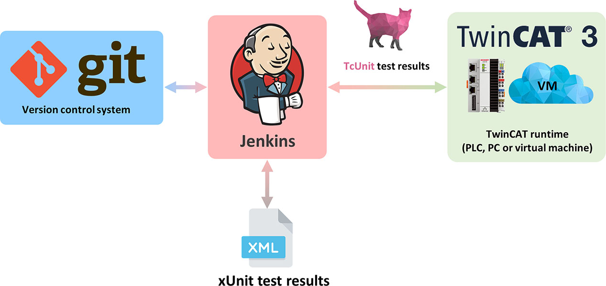

# User manual

This is the documentation for the TcUnit-Runner software.

## Introduction

This chapter will introduce you to the TcUnit-Runner software.
Prior to reading this introduction, it's highly recommended to have a basic understanding of the [unit testing concepts](https://tcunit.org/unit-testing-concepts/) and an understanding of how to [create unit tests for TwinCAT using TcUnit](https://tcunit.org/introduction-user-guide/).

With TcUnit-Runner it's possible to integrate TcUnit tests into a continuous integration/continuous delivery software development workflow.
This integration is done into an automation server such as [Jenkins](https://en.wikipedia.org/wiki/Jenkins_(software)).



With Jenkins and a version control system (such as Git or Subversion), it's possible to automatically run all unit tests in a TwinCAT project automatically if a TwinCAT project is changed in the version control system.
All test results are automatically generated and reported in standard [xUnit/JUnit XML format](https://llg.cubic.org/docs/junit/) which Jenkins natively supports.
This means that if any code is changed, all the unit tests can be run automatically once the code is committed into version control.
An example of how the result looks like after an execution of the tests looks like this:


In this screenshot we can see that our TwinCAT project has 112 failing and 139 successful tests.
We can also see that one test is configured to be [disabled](https://tcunit.org/frequently-asked-questions/?Display_FAQ=706)/skipped.


In the test history-tab in Jenkins we can see that the amount of tests (in blue) have increased over time for our TwinCAT project TcTelescopePowerLibrary, and we can also see how the amount of failed tests (in red) varies.

For maximum flexibility, TcUnit-Runner can be run on any host and it doesn't care whether the tests are running on a PLC, a desktop PC or even a virtual machine as long as it has TwinCAT installed.
TcUnit-Runner comes as a MSI package and is installed on either the Jenkins master or a Jenkins agent.
The basic components of the complete toolchain can best be described with the following figure:


To describe this on a high-level, there are multiple TwinCAT projects which are handled using version control, which is Git in this example (but could be any other version control system) and hosted on a Git repository (be it your own or an external such as GitHub).
The TwinCAT software developers do their work against the Git repositories which host the TwinCAT projects.
Next, we'll need an automation server, which is Jenkins in this case.
Jenkins will monitor for changes in Git, and execute a job if a change is detected.
The job defines a specific TwinCAT project for which we want to execute TcUnit tests for.
This job will execute TcUnit-Runner, which will compile the TwinCAT project and execute it in TwinCAT (which can run on a PLC, PC or even a virtual machine).
TcUnit-Runner will then collect the results from the TwinCAT runtime, and write them to a xUnit XML-file, which is then reported back to Jenkins.
As Jenkins understands xUnit, it will collect the results and present them to the user.
Now it's possible to do further processing in Jenkins, such as sending an e-mail to the developers if a test has failed.

There are various ways in which a toolchain for TcUnit tests can be configured.
In the simplest form, everything is installed on the same machine.


TcUnit-Runner is flexible in the way it is integrated, and there are many other ways to integrate it, as for example using a solution with one or multiple so-called Jenkins agents for each version of TwinCAT.
This is described in more depth in the test server architecture chapter.

Now, what does TcUnit-Runner actually do?
Once TcUnit-Runner has been executed by a Jenkins job it will do the following steps:


## Quick start

This guide will show you how to install and configure TcUnit-Runner in Jenkins.
It's highly recommended to read the [introduction chapter](#introduction) to TcUnit-Runner prior to reading this chapter.
In this guide, it's assumed that TcUnit-Runner and TwinCAT will be installed on the same machine as Jenkins.

**Prerequisites:**  

A machine with:

- A version control system (VCS) of choice installed for Jenkins to scan for code changes. In this example, Git is used
- [Jenkins](https://www.jenkins.io/) installed. Make sure Jenkins has the Git-plugin installed (default it is)
- The version(s) of TwinCAT that the TcUnit projects were created with. In this example, we are going to use an [example project](https://github.com/sagatowski/AdvancedExampleProject) that exists on GitHub. Obviously you can use your own TwinCAT project instead.
- A TwinCAT PLC full or 7-day test license activated on the machine that is going to run TwinCAT/the tests
- The TwinCAT projects need to use [TcUnit library version 1.1](https://github.com/tcunit/TcUnit/releases) (or later), so this needs to be installed. [Read this](https://tcunit.org/introduction-user-guide/) for how to install TcUnit.

In this guide, everything will be installed in the same machine for sake of simplicity.
If you want more information on how to install any of these prerequisites, it's recommended to read the complete jenkins installation and setup example.

First, start by [downloading](https://github.com/tcunit/TcUnit-Runner/releases) TcUnit-Runner (MSI package).
Start the installation.
In this example, when being asked in which directory to install TcUnit-Runner, leave it at the default (**C:\Program Files (x86)\TcUnit-Runner**).


Next, we need to create a job/project in Jenkins for our example TwinCAT project.
Login to Jenkins and create a new **freestyle project**.
In this example we are naming it **ExampleProject**.


Select Git in the **source code management part**, and enter the location of the TwinCAT project on the Git server (replace this with your choice of TwinCAT project if you want to):


Below Build Triggers, select **Poll SCM** and enter the value `H/5 * * * *` in the text box.
This means that Jenkins will poll for any changes in Git repository every five minutes.

Next, go to **Build** and click on **Add build step**.
Select **Execute Windows batch** command and in the **Command** text box enter:

`C:\Program Files (x86)\TcUnit-Runner\LaunchTcUnit.bat`

This windows batch script will find the TwinCAT solution file and execute it with the TcUnit-runner.

Next go to Post-build Actions and click Add post-build action.
TcUnit-Runner publishes test results in xUnit/JUnit format, which is natively supported by Jenkins.
Select **Publish JUnit test result report** and in the **Test report XMLs** textbox enter ***.xml**.
The last two steps should now look like this:


Click on **Save**.
Everything is now ready for a test-run!
Go to the Jenkins project and click on **Build now**.
TcUnit-Runner will execute the TcUnit tests in the TwinCAT project and return the results in a xUnit xml-file.
Once the tests have executed and the test results are returned, you can click on the build and then on the **Test Result**.
Here you will see all the test-suites and their results.

This was a quick introduction guide.
If you want to have a deeper introduction with examples of the different capabilities of TcUnit-Runner it's recommended to read the [test server architecture](https://tcunit.org/tcunit-runner-user-manual/#test-server-architecture).

## Test server architecture

TcUnit-Runner is flexible in how and where the tests are being run, be it on the same machine as the Jenkins server, another PC, a virtual machine or even a PLC.

This document will describe three different ways, but there are other ways than the three suggested to configure the toolchain.
The three different examples are:

1. Jenkins and all TwinCAT XAEs on same machine. TwinCAT XAR on machine (XAR could also be run on a separate PLC)
2. Jenkins master on separate machine and separate Jenkins agent for various TwinCAT XAEs. TwinCAT XAR on Jenkins agent
3. Jenkins master on separate machine. Multiple Jenkins agents with separate TwinCAT XAEs VMs on same machine. Multiple PLCs for different versions of TwinCAT

### Example #1 – All in one


This is the simplest example in where everything is running in one physical machine.
This includes installing Jenkins (master), all the different TwinCAT XAEs that need to be supported, and the TcUnit-Runner software.
Although this is most likely the configuration which is the easiest to start with, it's not very flexible.
Also, there might already be a Jenkins master in your organization already in which most likely you don’t want to install the various TwinCAT versions into.
Also, the current Jenkins master might even run on an operating system that does not support TwinCAT altogether (as Linux).
Because all the different TwinCAT XAEs (development environments) and the TwinCAT XAR (runtime) are on this machine, it needs to be Windows-based.

Because the tests are running on this machine, it needs to have a TC1200 license for execution of the TcUnit tests (PLC-code), which can be accomplished by either running a trial license on the machine (for a fixed time), or using a TC1200 license on the Beckhoff C9900-L100 USB-stick which can be activated on the machine.

### Example #2 – Separate Jenkins master & Jenkins agent


In this second example we already have a running Jenkins master and want to integrate our TwinCAT unit testing toolchain into the existing infrastructure.
This is achieved by creating a separate Jenkins agent that the Jenkins master calls every time a TwinCAT project needs to be tested.
This Jenkins agent has everything installed for it to be able to run all the different versions of TwinCAT projects that need to be handled.
Just as with example #1, this machine has a USB-license of TC1200 for it to run the TcUnit-tests (PLC-code).
The TcUnit-Runner software is installed on the agent as well.

### Example #3 – Multiple Jenkins agents


In the last example we are running everything inside a host, but here we are utilizing virtual machines instead for every version of TwinCAT.
This host is connected to a network with various PLCs, which are used to run the tests.
A variant is to skip the PLCs and run the tests directly in the virtual machines.

### Which architecture is the right for me?

These three examples are just suggestions, there are many other ways to design your architecture.
Some architectures might be combinations of the three.
For instance, in both example #1 and example #2 you can have real PLCs to run the tests instead of the actual PC/virtual machine.

Each and one these options have their advantages and disadvantages.
Some of the questions that should be asked are:

- Is there already a working Jenkins master in the organization?
- How do we want to handle licenses for TwinCAT to run the TcUnit tests? Maybe we have some spare PLCs with TwinCAT licenses already active, or maybe we simply want to buy a USB-stick with a TwinCAT license for one machine?
- Do we want to use the exact same TwinCAT XAR (runtime) to run the project as the project was developed in?
- Do we want to be able to handle more than one version of TwinCAT? Do we want a separate build-machine for every version of TwinCAT?

It's not possible to give a general recommendation for which architecture that should be used.
If you only need to support one single version of TwinCAT, any of these solutions will just as fine, although some of them might be more complex than others to implement.
You might already have a Jenkins master in your organization, and want to have one (or several) completely separate machine just for running the TwinCAT unit tests, in case it makes sense to configure a Jenkins agent (slave) just for TwinCAT (and thus, resembling example #2 architecture).
Some general rules can be given for a specific set of requirements.
Generally speaking, if you only want to use a trial license or buy a single license of TC1200, the solution with a machine with all versions of TwinCAT is recommended, as it might not be economical to have a machine/PLC for every version of TwinCAT that you need to support (unless you already have spare PLCs or simply run with lower performance PLCs for running the tests).
By using Beckhoffs trial license functionality it's possible to try an architecture and run with trial licenses of TC1200 (that don't cost any money) in the beginning to see if the architecture makes sense in the long run.
In the full example, we will be utilizing a PLC with a pre-installed.


## Complete Jenkins installation and setup example

This chapter will describe a 100% complete installation of a complete unit testing toolchain for TwinCAT using TcUnit-Runner.
This will include:

- Creation of a Jenkins master (on a Windows host)
- Creation of a Jenkins agent (slave) that will do the actual runs of the TwinCAT unit tests
- Creation of a Jenkins job on the Jenkins master, that is responsible triggering a run of tests on the Jenkins agent for a TwinCAT project if source code is changed in Git

The target audience for this chapter is primarily people that might never had worked with Jenkins and need the complete toolchain.
If your organization already has a build automation tool (such as Jenkins), you most likely want to use that.

The architecture chosen is similar to the one in example #2 in chapter [test server architecture](#test-server-architecture), although we will use a separate PLC to run the actual tests.
All possible versions of TwinCAT will be supported, which is accomplished by installing the different versions of TwinCAT on the Jenkins agent.
Another variant could be to have a separate agent for every version of TwinCAT that you want to be supported.
In this example, only one version of TwinCAT will be installed (3.1.4022.30).
If you want support for more versions, simply install the full XAE or the remote manager version on the agent for all the TwinCAT versions that you need.
As the time of writing this document, version 2.235.5 of Jenkins was used as example.


Because we are using a PLC to run the tests, the PLC has a license for [TC1200](https://www.beckhoff.com/en-en/products/automation/twincat/tc1xxx-twincat-3-base/tc1200.html).
If you would rather run the tests directly in the Jenkins agent, you will need either a trial license or a license on a Beckhoff C9900-L100 USB-stick.

### Installation of Jenkins master

Prerequisites for the Jenkins master:

- [Java JRE or JDK](https://www.java.com/) installed
- [Git](https://git-scm.com/) installed

Start by [downloading Jenkins](https://www.jenkins.io/download/).
The LTS (Long-Term Support) version is recommended, as this is generally more stable than the regular release version.
Start the installation and install it to the default location.
Make sure to select **Run service as local or domain user** and enter the username and password of the local user of that machine.


If the username and password does not work while pressing the **Test Credentials**-button, do as suggested in [this thread](https://stackoverflow.com/questions/63410442/jenkins-installation-windows-10-service-logon-credentials).
The password should not be empty.
Once you have tested the credentials and everything is working, you can click **Next**.
In **Port Selection**, leave the port at default **8080**, click **Test Port** and then click **Next**.


Select the folder of your Java JDK or JRE and click **Next**.


Now Jenkins will be installed.
Once it's installed, the default web browser should popup and request you to unlock Jenkins by copying the password from the file in the specified location to the text box.
In the next window it will ask you to customize Jenkins.
Select Install suggested plugins.
This will install the most common plugins, as support for Git and JUnit test results (which is the same format that TcUnit uses).


Depending on the speed of your internet connection and the machine this might take some time.
Jenkins will present you with a status window.


Once finished, all the plugins will be green.
Next you will be asked to create the first admin user for Jenkins.
In this example the user TwinCAT_Master will be created.


Click on **Save** and **Continue** and then again on **Save and Finish**.
Now we have our Jenkins master ready.
Next, we will manage the Jenkins agent (slave), which will be the machine that actually runs our tests and reports the results back to the master.
First, we need to create the agent by clicking on **Manage Jenkins** in the left-menu and then on **Manage Nodes and Clouds**.


Click on **New Node**.
Enter a **Node name** and select **Permanent Agent**.
In this example the agent was named **TwinCAT_Agent**. Next, we need to specify which the default directory will be on the agent for all Jenkins jobs (i.e. where the TwinCAT projects will be stored).
Also make sure to tick **Use WebSocket**, which allows the master and agent to communicate over a HTTP(S) port.


Next, we need to connect the Jenkins agent to the Jenkins master, which we'll do in the next chapter.

### Installation of Jenkins agent/slave

The Jenkins agent is the machine that will compile/build the TwinCAT unit tests (written with the TcUnit framework), and activate the project on the PLC and report them back to the Jenkins master in a standard JUnit/xUnit XML format.

The prerequisites for the Jenkins agent:

- Java JRE or JDK installed
- Git installed
- The Visual studio version(s) that you want to be supported for your different TwinCAT projects installed
- The version(s) of TwinCAT XAE that you want to be supported for your different TwinCAT projects installed
- TcUnit 1.1 (or later) installed. [Read this](https://tcunit.org/introduction-user-guide/) for how to install TcUnit
- TcUnit-Runner installed. See the [quick start](#quick-start) for how to download and install TcUnit-Runner into the machine

In this example, we will be running tests for a project created in TwinCAT 3.1.4022.30 and Visual Studio 2013 (bundled with the TwinCAT 3.1.4022.30 XAE).

Next, we need to link the agent to the master.
To connect the agent to the master we need to download a file from the master that we need to copy to the slave.
In Jenkins go to the TwinCAT-agent (**Manage Jenkins** → **Manage Nodes and Clouds** → **TwinCAT_Agent**).
Click on the orange Launch-button.
This will download a file named **slave-agent.jnlp**.
Move this file to the desktop of the agent/slave.
Double-clicking on this file in the agent will execute it and should make the agent try to connect to the master.


(in this example the master is at the IP-address `192.168.4.201`, and the agent at `192.168.4.202`).
If the connection was successful, the window below will popup. Click on **Run**.


Next the agent application will launch, and a minimalistic window will be shown.

[Jenkins slave downloading application](/img/jenkins_slave_downloading_application_3.png)

Now the Jenkins agent is connected to the Jenkins master and is awaiting a job to be executed.
It's highly recommended to install the Jenkins agent as a service so that it's automatically started every time the machine is booted.
How this is accomplished can be read [here](https://www.jenkins.io/doc/book/using/using-agents/) or [here](https://devopsbuzz.com/jenkins-file-menu-missing/).

As a final step we need to create an ADS-connection from the Jenkins agent to the PLC that will run our tests. This is accomplished by TwinCAT standard procedure by (inside the agent) right-clicking on the TwinCAT-icon and clicking **Router** → **Edit Routes** → **Add**...
Enter the IP-address of the PLC (in this case, `192.168.4.213`).
Make sure the Jenkins agent is connected to the PLC (marked with **x** in the **Connected column**).


### Execution of job

In this chapter we will do the final step of creating the job in the master and launching it so that the agent does the job of running the tests.
First, create a Jenkins job according to the quick start.
Make sure to configure the job to run on your newly created agent. When creating the job, tick the **Restrict where this project can be run** tickbox and enter the name of the agent (in this case, **TwinCAT_Agent**).


You also need to make sure that the PLC is used as the target AmsNetId for running the tests (otherwise the local AmsNetId (127.0.0.1.1.1), in other words the Jenkins agent would be used to run the TcUnit tests).
This can be accomplished by adding the `-a` parameter, using our PLC/example it would be `-a 5.44.93.176.1.1`.


Finally, we are ready to execute the job.
Click on **Build** in the left menu for the job.

While the job is executing it's possible to check the progress by pressing the **Console output**. It should look something like this:

```CMD
Started by user Jakob
Running as SYSTEM
Building remotely on TwinCAT_Agent in workspace C:\Jenkins\workspace\TwinCATExampleProject
The recommended git tool is: NONE
No credentials specified
Cloning the remote Git repository
Cloning repository https://github.com/sagatowski/AdvancedExampleProject
 > git.exe init C:\Jenkins\workspace\TwinCATExampleProject # timeout=10
Fetching upstream changes from https://github.com/sagatowski/AdvancedExampleProject
 > git.exe --version # timeout=10
 > git --version # 'git version 2.28.0.windows.1'
 > git.exe fetch --tags --force --progress -- https://github.com/sagatowski/AdvancedExampleProject +refs/heads/*:refs/remotes/origin/* # timeout=10
 > git.exe config remote.origin.url https://github.com/sagatowski/AdvancedExampleProject # timeout=10
 > git.exe config --add remote.origin.fetch +refs/heads/*:refs/remotes/origin/* # timeout=10
Avoid second fetch
 > git.exe rev-parse "refs/remotes/origin/master^{commit}" # timeout=10
 > git.exe rev-parse "refs/remotes/origin/origin/master^{commit}" # timeout=10
Checking out Revision 28c43935186ef8a60b8cd73f69e08e3774e2fd3c (refs/remotes/origin/master)
 > git.exe config core.sparsecheckout # timeout=10
 > git.exe checkout -f 28c43935186ef8a60b8cd73f69e08e3774e2fd3c # timeout=10
Commit message: "Created TcUnit example project to be used for explanation of TcUnit-Runner."
 > git.exe rev-list --no-walk 28c43935186ef8a60b8cd73f69e08e3774e2fd3c # timeout=10
[TwinCATExampleProject] $ cmd /c call C:\Users\Jakob\AppData\Local\Temp\jenkins5815231439158158621.bat
 
C:\Jenkins\workspace\TwinCATExampleProject>"C:\Program Files (x86)\TcUnit-Runner\LaunchTcUnit.bat" -a 5.44.93.176.1.1 
Task name of the TcUnit task not provided! Assuming only one task in TwinCAT solution
An AmsNetId has been provided, using: 5.44.93.176.1.1
VISUAL_STUDIO_SOLUTION_PATH found!
The filepath to the visual studio solution file is: "C:\Jenkins\workspace\TwinCATExampleProject\IOLink.sln"
2020-08-30 07:56:27 - TcUnit-Runner build: 1.0.0.0
2020-08-30 07:56:27 - TcUnit-Runner build date: 2020-08-29
2020-08-30 07:56:27 - Visual Studio solution path: C:\Jenkins\workspace\TwinCATExampleProject\IOLink.sln
2020-08-30 07:56:27 - 
2020-08-30 07:56:27 - In TwinCAT project file, found TwinCAT version 3.1.4022.30
2020-08-30 07:56:27 - In Visual Studio solution file, found visual studio version 12.0
2020-08-30 07:56:27 - Checking if there is an existing Visual Studio process to attach to ...
2020-08-30 07:56:27 - ... none existing Visual Studio process found. Creating new instance of visual studio DTE.
2020-08-30 07:56:27 - Trying to load the Visual Studio Development Tools Environment (DTE) version 'VisualStudio.DTE.12.0' ...
2020-08-30 07:56:31 - ...SUCCESSFUL!
2020-08-30 07:56:31 - Using the TwinCAT remote manager to load TwinCAT version '3.1.4022.30'...
2020-08-30 07:56:48 - No task name provided. Assuming only one task exists
2020-08-30 07:56:48 - Found task with name 'PlcTask'
2020-08-30 07:57:00 - Setting target NetId to '5.44.93.176.1.1'
2020-08-30 07:57:01 - Enabling boot project and setting BootProjectAutostart on 5.44.93.176.1.1
2020-08-30 07:57:46 - Waiting for results from TcUnit...
2020-08-30 07:57:57 - ... got 104 report lines so far.
2020-08-30 07:57:57 - All results from TcUnit obtained
2020-08-30 07:58:00 - Done collecting TC results
2020-08-30 07:58:00 - Writing xUnit XML file to C:\Jenkins\workspace\TwinCATExampleProject\TcUnit_xUnit_results.xml
2020-08-30 07:58:00 - Closing the Visual Studio Development Tools Environment (DTE)...
2020-08-30 07:58:17 - Exiting application...
Exit code is 0
Recording test results
Finished: SUCCESS
```

Click on the **Test Result** after the job is finished to see the test results of TcUnit.


## TcUnit-Runner installation

See the [quick start](#quick-start).

### TcUnit-Runner arguments/options

This chapter will describe the different arguments of TcUnit-Runner and how they can be used to set specific behavior for a Jenkins job.
The parameters that can be supplied are:

`-t [OPTIONAL] The name of the task running TcUnit defined under "Tasks"`

Used for instance if you have several tasks in the same project, but only want to run the TcUnit-task.
If this parameter is provided, TcUnit-Runner will disable all tasks except for the user provided taskname.
If this is not provided, it’s assumed that only one task exists in the TwinCAT project.

`-a [OPTIONAL] The AMS NetId of the device of where the project and TcUnit should run`

With this argument it’s possible to tell TcUnit-Runner to run the tests on another TwinCAT runtime than where TcUnit-Runner is installed.
If the argument is not provided, the local AMS NetId is assumed (127.0.0.1.1.1).
Note that if an AMS NetId is provided, it’s necessary that an AMS-route is created between the machine which runs the TcUnit-Runner and to the AMS NetID machine.

`-w [OPTIONAL] The TwinCAT version to be used`

With this argument it's possible to force the TwinCAT version to be used to a specific version.
If the argument is not provided, either one of these two cases will happen:

1. If the project is pinned to a specific version, the pinned TwinCAT version is used
2. If the project is not pinned, the latest installed TwinCAT version is used

`-u [OPTIONAL] Timeout the process(es) with an error after X minutes`

Under certain circumstances, Visual Studio can stop responding while loading a TwinCAT project, and if this parameter is not provided the process will be running indefinitely or until it is being killed.
Providing this argument will provide an upper bound for how long the TcUnit-Runner process + any eventual Visual Studio processes are allowed to run.
If timeout is reached, these processes are automatically killed.

## Batch file configuration

The batch file LaunchTcUnit.bat is the link between the Jenkins job and the TcUnit-Runner application.
This batch-file is installed with the TcUnit-Runner application and should normally not be changed.
If the application is not installed to the default folder `C:\Program Files (x86)\TcUnit-Runner` the following line in the batch-script needs to be changed:
`SET TCUNIT_RUNNER_INSTALL_DIRECTORY=C:\Program Files (x86)\TcUnit-Runner`

## GitHub action

Runs on a self-hosted runner, i.e. a VM with Windows 10 and TwinCAT installed.

Prerequisites:

- [Add a self hosted runner to a repository](https://docs.github.com/en/actions/hosting-your-own-runners/managing-self-hosted-runners/adding-self-hosted-runners#adding-a-self-hosted-runner-to-a-repository)
- Optional with tag, i.e. `tcunit`. If you have multiple runners connected to your repository/organization, a tag like `tcunit` specifies exactly on which runner a workflow can run.
- Create a folder `.github/workflows/` in your repository.
- In that folder, add a workflow file, i.e. `.github/workflows/build_and_test.yml`:

```YML
# Demo CI workflow with TcUnit-Runner
name: TcUnit-Runner
 
on:
  push:
    branches: [ main ]
  pull_request:
    branches: [ main ]
 
jobs:
 
  tcunit_runner:
 
    # a self hosted runner, i.e. VM with tag 'tcunit'
    runs-on: [ self-hosted, tcunit ]
 
    steps:
 
      - name: Checkout repository
        uses: actions/checkout@v2
 
      - name: Run TcUnit-Runner
        shell: cmd
        # Start TcUnit-Runner with a timeout of 5 min
        run: '"C:\Program Files (x86)\TcUnit-Runner\LaunchTcUnit.bat" -U 5'
```

- The workflow will be triggered on every pull-request or push to branch `main` on your self-hosted runner.
- Optional, reporting annotations:

```YML
# report annotations
- uses: KyleAure/junit-report-annotations-action@1.5
  if: always()
  with:
    name: results TcUnit tests
    path: ${{ github.workspace }}/**/TcUnit_xUnit_results.xml          
    access-token: ${{ secrets.GITHUB_TOKEN }}
```

Thanks to [@densogiaichned](https://github.com/densogiaichned) for instructions.

## Azure pipelines

Runs on a self-hosted agent, i.e. a VM with Windows 10 and TwinCAT installed.

**Prerequisites:**

- [Integrate Your GitHub Projects With Azure Pipelines](https://www.azuredevopslabs.com/labs/azuredevops/github-integration/)
- [Add a self-hosted agent to Azure Pipelines](https://learn.microsoft.com/en-us/azure/devops/pipelines/agents/agents?view=azure-devops&tabs=yaml%2Cbrowser), and name it, i.e. `tcunit`.
- Create a [Azure Pipeline](https://learn.microsoft.com/en-us/azure/devops/pipelines/?view=azure-devops). This will add a `azure-pipelines.yml` in your repository, copy and paste the following content:

```YML
# Demo CI workflow with TcUnit-Runner
name: TcUnit-Runner  
 
trigger:
- main
pr:
- main  
 
pool: 'tcunit'    # self-hosted agent  
 
steps: 
 
- checkout: self
    displayName: Checkout repository  
 
- task: CmdLine@2
    displayName: Run PLC unit-tests with TcUnit-Runner 
    condition: succeeded()
    inputs:
        failOnStderr: true
        # Start TcUnit-Runner with a timeout of 5 min
        script: '"C:\Program Files (x86)\TcUnit-Runner\LaunchTcUnit.bat" -U 5'
     
- task: PublishTestResults@2
    displayName: Publish TcUnit results
    condition: or(succeeded(),failed())     
    inputs:
    testResultsFormat: 'JUnit'
    testResultsFiles: '**/TcUnit_xUnit_results.xml'
```

- Save and run your new Pipeline.
- The workflow will be triggered on every pull-request or push to branch main on your self-hosted agent.

Thanks to [@densogiaichned](https://github.com/densogiaichned) for instructions.

## Problems/questions?

If you have any problems or questions, first make sure to read the [F.A.Q.](https://tcunit.org/frequently-asked-questions/), and if you don’t find your answer there, check the open and closed issues of [TcUnit](https://github.com/tcunit/TcUnit/issues) and [TcUnit-Runner](https://github.com/tcunit/TcUnit-Runner/issues).
If that doesn’t help you, check the [discussions](https://github.com/tcunit/TcUnit/discussions).
